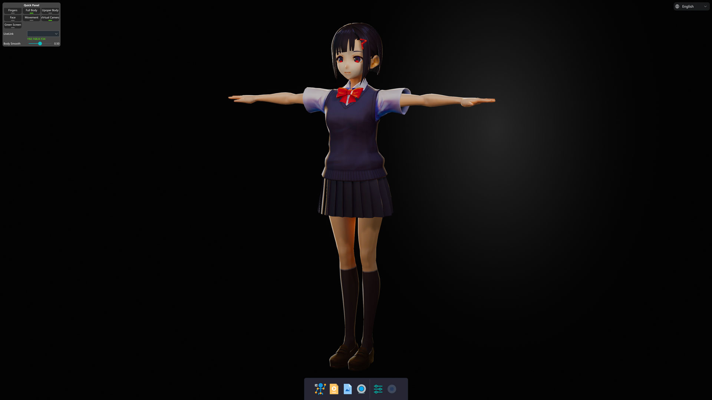

# VActor 

基于 Google Mediapipe , UnrealEngine 的动补、面补软件   

> 本软件基于 UnrealEngine 插件 **[MediaPipe4U](https://github.com/endink/Mediapipe4u-plugin)** 制作。
---

**下载地址**

<!-- [奶牛快传 (2022-12-09)](https://cowtransfer.com/s/cd23fdb4593749)   
[OneDrive (2022-12-09)](https://1drv.ms/u/s!AkmROUeQfSBjzWbeKL_cdrlzYVYa?e=hbDTbN) -->

视频动补有 BUG，紧急下架修复中~

**功能**

- VRM 模型加载
- RGB摄像头实时动补
- RGB摄像头实时面补（实验性）
- Arkit面补支持
- 虚拟摄像头
- 预制灯光效果
- 动画数据导出（BVH 格式）
- 自定义渲染效果

**视频介绍合集：**

[B站](https://space.bilibili.com/481665211/channel/collectiondetail?sid=810148)

---   
**特别感谢**

感谢 **[Noesis GUI](https://www.noesisengine.com/)** 为本软件提供了个人免费授权。

---   
**Third Party License**

The software contain components from Google MediaPipe, VRM4U, CryptoPP, NoesisGUI, GStreamer (dynamic link). These components are governed by separate agreements and their respective product support policies, but if separate license terms for these components are included directly in the installation directory, those license terms shall control.

## 更新日志

### 12月09日
- [fix]修复纹理流送 BUG（不确定这是不是一个 BUG，见 #5）
- [fix]脊柱锁定设置不生效 BUG
- [new]位移标定计时板显示
- [new]位移锁定（可以控制是否计算/垂直/水平/前后位移）
- [new]渲染效果控制（实验性：shader 参数调整，支持动态切换 lit,sss,unlit 等效果）

### 12月06日

- [new]BVH 动画数据导出支持
- [new]视频动补时间进度条拖动支持

